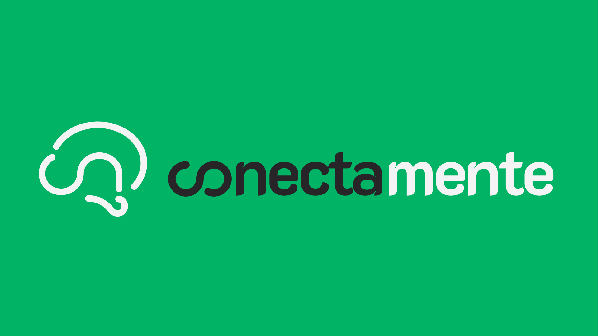
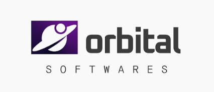

#  
# **Conectamente**

Sistema web voltado para fortalecer a comunicação entre **terapeutas**, **responsáveis** e **pacientes neurodivergentes**, promovendo acompanhamento contínuo do desenvolvimento terapêutico.

---

# 📘 **Descrição Geral do Sistema**

O **ConectaMente** é uma plataforma que centraliza a comunicação entre famílias e profissionais terapeutas. Seu objetivo principal é manter todos alinhados sobre o progresso terapêutico dos pacientes, permitindo o envio de relatórios, diário compartilhado, planos terapêuticos e feedbacks em um ambiente seguro, responsivo e de fácil uso.

---

# 👥 **Perfis de Usuários e Funcionalidades Principais**

---

## 🧑‍👩‍🦱 **Responsável**

- Cadastro e gerenciamento de dependentes/pacientes.  
- Registro no Diário do Paciente (texto, foto, vídeo e link).  
- Visualização do Plano Terapêutico criado pelo terapeuta.  
- Envio de feedbacks sobre atividades e orientações.  
- Upload de relatórios em PDF.  
- Edição de descrições importantes sobre o paciente.  
- Desvincular dependente de um terapeuta.  

---

## 🩺 **Terapeuta**

- Vinculação de pacientes via CPF/chave.  
- Criação e edição de Planos Terapêuticos.  
- Criação de Checklists de acompanhamento.  
- Publicação de observações, anotações e registros gerais.  
- Compartilhamento de relatórios PDF.  
- Visualização e gerenciamento do diário compartilhado com a família.  
- Desvinculação de pacientes.  
- Busca e listagem de pacientes vinculados.  

---

## 🛠️ **Administrador**

- Cadastro de responsáveis, terapeutas e novos administradores.  
- Exclusão de contas.  
- Gerenciamento de vínculos e informações gerais.  
- Acesso a logs de auditoria de usuários.  
- Visualização e gerenciamento de denúncias.  

---

# 🔐 **Principais Características de Segurança**

- **Criptografia de dados sensíveis (LGPD)**: Informações como senhas e dados privados são armazenados criptografados.  
- **Autenticação segura** com validações robustas.  
- **Proteção de dados em trânsito** via HTTPS.  
- **Uso de cookies seguros** para identificação de sessão.  
- **Registro de logs e rastreabilidade** para auditoria.  
- **Restrição forte para senhas** e validações de formulário.  

---

# 🌐 **Características de Comunicação do Sistema**

- **API REST** para comunicação entre frontend e backend.  
- **Protocolo HTTPS** garantindo integridade e sigilo das informações.  
- **Arquitetura distribuída**, com backend e frontend desacoplados.  

---

# 🎨 **Características Visuais**

- Interface moderna e limpa.  
- Layout responsivo (desktop e mobile).  
- Telas organizadas por perfis: responsável, terapeuta e administrador.  
- Uso de **Figma** para prototipação e padronização do design.  

---

# 🧰 **Ferramentas, Tecnologias e Linguagens Utilizadas**

### **Frontend – Flutter**
- Framework multiplataforma.  
- Alta performance e responsividade.  
- Interface consistente usando widgets reutilizáveis.

### **Backend – Golang (Go)**
- Linguagem de alta performance.  
- Concorrência nativa com goroutines.  
- Ideal para APIs rápidas e escaláveis.

### **Banco de Dados – MySQL**
- Banco relacional robusto.  
- Armazena dados estruturados como planos, registros e vínculos.  
- MySQL Workbench utilizado para modelagem e manutenção.

### **Armazenamento de Arquivos – BLOB Storage**
- Armazenamento de mídia e documentos.  
- Permite guardar imagens, PDFs e vídeos de forma eficiente.  
- Integrado ao backend do sistema.

### **Hospedagem – Railway**
- Deploy rápido de backend e banco de dados.  
- Suporte a containers, serviços e variáveis de ambiente.  
- Ótima para aplicações em Go, bancos SQL e armazenamento.

### **Documentação – Notion & Draw.io**
- Organização estruturada da documentação.  
- Criação de diagramas de casos de uso, classes e fluxos.  

### **Design – Figma**
- Protótipos visuais e UX definidas com precisão.  
- Padronização de componentes e telas.

### **Versionamento – GitHub**
- Controle de versões do projeto.  
- Colaboração entre toda a equipe.

---

# 🎥 **Demonstração do Sistema**

👉 **Vídeo do Sistema:**  
<COLOQUE_AQUI_O_LINK_DO_VÍDEO>

---

# 📄 **Documentação Completa**

👉 **Documentação Oficial do Sistema:**  
<COLOQUE_AQUI_O_LINK_DA_DOCUMENTAÇÃO>

---

# 📝 **Teste de Aceitação de Usuários**

👉 **Formulário para Teste de Aceitação:**  
<COLOQUE_AQUI_O_LINK_DO_FORMULÁRIO>

---

# 🏢 **Sobre a Empresa**

## **Orbital Softwares**

**Integrantes da Equipe:**
- Camila De Araújo Bastos  
- Felipe da Silva Ferreira  
- Gabriel da Silva e Silva  
- João Victor Macedo dos Santos Lima  
- José Victor de Oliveira Correia  
- Lucas de Andrade Pereira Mendes  
- Pierre Machado Mendes Novaes  
- Rodrigo Reis Lucena Nazareth  
- Tiago de Figueiredo Moura  
- Uemerson Virgen de Jesus  

📧 **Email de Contato:**  
**orbitalsoftwares@gmail.com**

---
